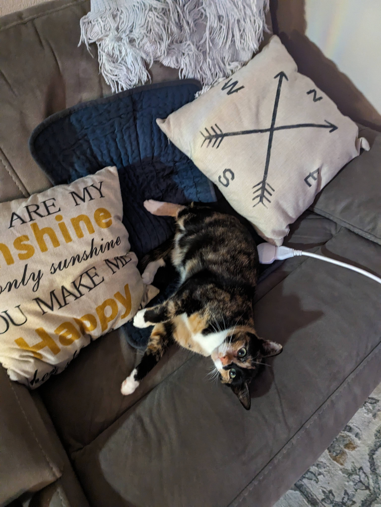

Hello, I am Tristan Ross. I've been a Linux user and programmer for over a decade now.
As 2023 is coming to a close and 2024 looms ever so closer, I've been reflecting on
the events in the past year. That has led me to the decision of redesigning my website
and adding a blog to it. My goal is for other fellow Linux users and programmers to
get an understanding of how I do things so they can be inspired. Another goal is for
future employers. As I have had been unsuccessful at getting a job after my previous
employment in tech, I believe having a blog could show for my skills until I complete
my bachelor's degree.

One major event I would like to reflect on here is my Japan trip. The cover photo of this
post is one I took of a shrine in Kyoto during my two-week vacation. I started my trip
by leaving from LAX and landing in NRT. I took Japan Airlines and it was the best airline
service I had taken other than Alaska. I got to experience many things that I had been
looking forward to. A few of the favorites are the Gundam in Yokohama, Gundam Base, walking
around Akihabara, taking the Shinkansen (bullet train), and staying at a Ryokan (traditional
Japanese inn). I might make a post at a later date further reflecting on this particular trip.

Between my Japan trip and now, not too much has occurred. I've been continuing to work on ExpidusOS
and progressing towards getting my associates degree. Though, I did get a refurbished 2021 Macbook
Pro M1 Pro. I decided to then install NixOS which caused me to land on [@tpwrules](https://github.com/tpwrules)'s
[nixo-apple-silicon](https://github.com/tpwrules/nixos-apple-silicon) Flake. I may make future posts here about
my experience with Apple Silicon and even a guide to installing NixOS to your own Apple Silicon device.

Anyway, that's it for the first post to this website. I'll leave you off with a photo of one of my cats.

